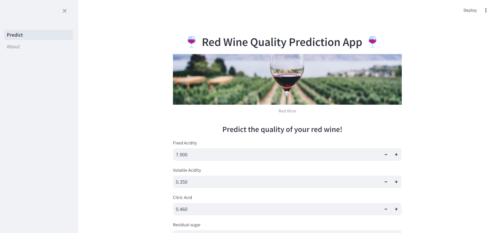
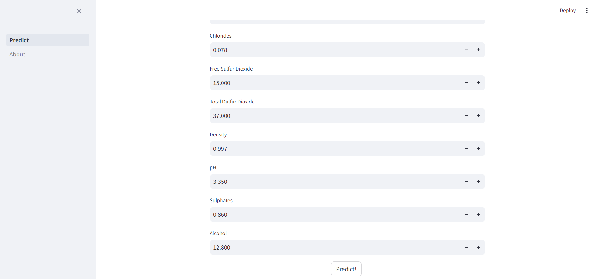
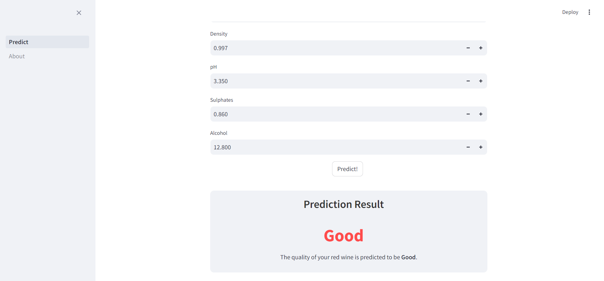
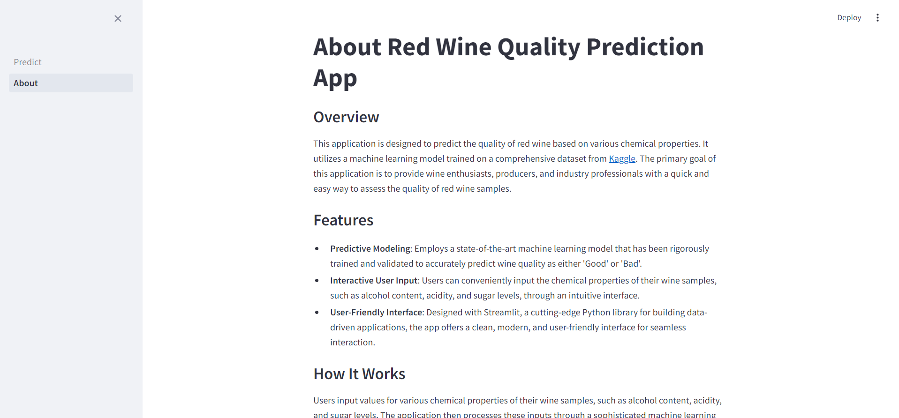

# Red Wine Quality Prediction

This application is designed to predict the quality of red wine based on various chemical properties. It utilizes a machine learning model trained on a comprehensive dataset from [Kaggle](https://www.kaggle.com/datasets/uciml/red-wine-quality-cortez-et-al-2009/data). The primary goal of this application is to provide wine enthusiasts, producers, and industry professionals with a quick and easy way to assess the quality of red wine samples.

## Table of Contents

- [Installation](#installation)
- [Usage](#usage)
- [Examples](#examples)
- [Contributing](#contributing)
- [License](#license)

## Installation

1. Clone the repository:
```
git clone https://github.com/your-username/your-repo.git
```

2. Navigate to the project directory:
```bash
cd Wine-Quality-Prediction
```

3. Create a virtual environment (optional but recommended):
```bash
python -m venv env
```

4. Activate the virtual environment:
   - On Windows:
     ```bash
     env\Scripts\activate
     ```
   - On Unix or Linux:
     ```bash
     source env/bin/activate
     ```

5. Install the required dependencies:
```bash
pip install -r requirements.txt
```

## Usage

1. **Running the App**: To use the Red Wine Quality Prediction App, execute the following command in your terminal:
```bash
streamlit run Prediction.py
```

This will start the Streamlit server and open the application in the default web browser.


2. **Using the App**: After launching the app, the Red Wine Quality Prediction App interface will appear. Follow the instructions on the screen to input the chemical properties of the red wine.

    - Navigate through the input fields and enter the values for each chemical property of the wine.
    - Once all inputs are filled, click the "Predict!" button to see the quality prediction of the red wine.

4. **Interpreting Results**: The app will display the predicted quality of the red wine based on the input values. The prediction is given as a quality category, helping to understand the potential quality of the wine. 

5. **Feedback and Improvements**: We welcome feedback and suggestions for improvements. Feel free to contribute to the project by submitting pull requests or opening issues on the project's GitHub page.

Enjoy exploring the nuances of red wine quality with the prediction app!

## Examples






## Contributing

All contributions are welcomed from everyone, whether it's reporting an issue, submitting a pull request, or suggesting improvements. By following these guidelines, you'll help in maintaining a consistent and high-quality codebase.

1. Fork the repository on GitHub.
2. Clone the forked repository to your local machine.
3. Create a new branch from the `main` branch.
4. Make your changes and commit them with descriptive commit messages.
5. Push your changes to your forked repository.
6. Open a pull request in the original repository, describing your changes and their purpose.


If you encounter any issues or have suggestions for improvements, please open an issue in the repository. Be sure to provide a clear description of the problem or suggestion, along with any relevant information or code examples.

Thank you for your contributions!

